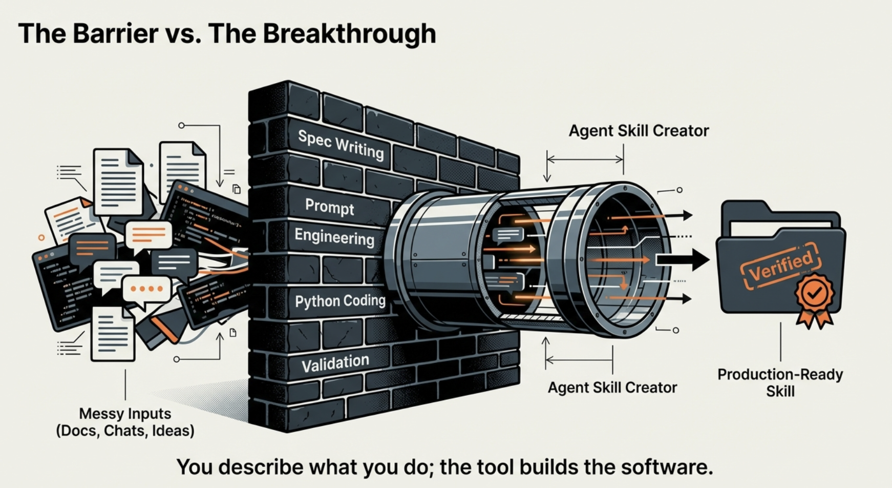

# Agent Skill Creator

**Turn any workflow into reusable AI agent software — no spec writing, no prompt engineering, no coding required.**

[](https://github.com/anthropics/agent-skills-spec)
[]()
[]()



---

## The Problem

Every AI agent (Claude Code, GitHub Copilot, Cursor, Windsurf, Codex, Gemini) starts from zero. It doesn't know your company's processes, data sources, or compliance requirements. So every person re-explains the same workflows in every conversation. Knowledge stays in individual chat histories. New hires start from scratch.

**Agent skills fix this.** A skill is structured knowledge your agent loads automatically — like installing an app. Once installed, anyone on your team can invoke it and get consistent results, every time, on any platform.

**The catch:** building a proper skill requires understanding the spec format, writing clear prompt instructions, designing how information loads progressively, writing functional code, and getting activation keywords right. Even simple skills take [multiple rounds of iteration](https://www.youtube.com/watch?v=izJkgLqlbN8) to get right.

**Agent Skill Creator removes that barrier entirely.** You pass in whatever you have — messy docs, links, code, PDFs, transcripts, vague descriptions — and it produces a validated, security-scanned skill ready to install and share. You describe what you do; it builds the software.

---

## Quick Start

### 1. Install (one command)

```bash
# Claude Code (global — works in all projects)
git clone https://github.com/FrancyJGLisboa/agent-skill-creator.git ~/.claude/skills/agent-skill-creator

# VS Code with GitHub Copilot (global — works in all projects, requires VS Code 1.108+)
git clone https://github.com/FrancyJGLisboa/agent-skill-creator.git ~/.claude/skills/agent-skill-creator

# Cursor (per-project)
git clone https://github.com/FrancyJGLisboa/agent-skill-creator.git .cursor/rules/agent-skill-creator
```

Claude Code and VS Code Copilot share the same global path (`~/.claude/skills/`) — one install works for both. Cursor requires per-project install; see [global workaround](#cursor--global-install).

Other platforms: [see full list below](#all-platforms).

### 2. Use it

Open your agent and type `/agent-skill-creator` followed by whatever you have:

```
/agent-skill-creator Every week I pull sales data from our CRM, clean
duplicate entries, calculate regional totals, and generate a PDF report.
```

You can pass anything — plain English, documentation links, existing code, API docs, PDFs, database schemas, transcripts. Combine multiple sources in one message. The more context, the better the result.

```
/agent-skill-creator Based on our deployment runbook: https://wiki.internal/deploy-process
```

```
/agent-skill-creator See scripts/invoice_processor.py — turn it into a reusable skill
```

```
/agent-skill-creator Here's our API docs: https://api.internal/docs
Create a skill that queries stock levels and generates reorder reports.
```

### 3. What comes out

A complete skill, automatically installed on your platform:

```
Skill installed successfully.

To use it, open a new session and type:

  /sales-report-skill Generate the weekly report for the West region

Installed at: ~/.claude/skills/sales-report-skill
```

The agent detects your platform (Claude Code, Cursor, Copilot, etc.), installs the skill to the right location, and tells you exactly how to invoke it. No manual steps.

The generated skill directory looks like this:

```
sales-report-skill/
├── SKILL.md          # Skill definition (activates with /sales-report-skill)
├── scripts/          # Functional Python code
├── references/       # Detailed documentation
├── assets/           # Templates, configs
├── install.sh        # Cross-platform installer (for sharing with others)
└── README.md         # Installation instructions (for sharing with others)
```

Your team installs it the same way they installed agent-skill-creator — one `git clone` — and invokes it with `/sales-report-skill`. The included `install.sh` auto-detects their platform too.

---

## How It Works

You don't need to understand any of this to use it. But if you're curious:

The agent doesn't just follow your description literally. Humans describe what they *do*, not what they *need*. "I pull sales data and make a report" hides a dozen implicit requirements — who reads the report, what format, what happens when data is missing. The agent reads all your material, uncovers these implicit requirements, and generates its own internal specification before writing any code. It builds from that deeper understanding, not from your surface description.

```
UNDERSTAND    Read all material → uncover real intent → generate internal spec
BUILD         Structure directory → write code and docs → craft activation keywords
VERIFY        Spec validation → security scan → block delivery if either fails
```

Every skill is automatically validated (correct structure, naming, metadata) and security-scanned (no hardcoded keys, no credential exposure, no injection risks) before delivery. Skills that fail these checks are blocked.

---

## Share Skills Across Your Team

After the agent builds and installs your skill, it asks:

```
Want to share this skill with your team so they can install it too?
```

Say yes. The agent detects whether your team uses GitHub or GitLab, creates a repo, pushes the skill, and gives you a one-liner to share:

```
Shared! Your colleagues can install it by pasting this in their terminal:

  git clone https://github.com/your-org/sales-report-skill.git ~/.claude/skills/sales-report-skill
```

or for GitLab teams:

```
  git clone https://gitlab.com/your-org/sales-report-skill.git ~/.claude/skills/sales-report-skill
```

Send that line to your colleague on Slack or Teams. They paste it. Done. They can now type `/sales-report-skill` in their agent.

No registry commands, no publishing steps, no terminal knowledge beyond paste. The agent handles the repo creation, the push, and generates install commands for every platform. Works with GitHub, GitLab, GitHub Enterprise, and self-hosted GitLab instances.

### The result over time

Each team member creates skills from their own domain and shares them. Over months the organization accumulates a library of reusable skills:

- Sales team shares `/sales-report-skill`
- Engineering shares `/deploy-checklist-skill`
- Legal shares `/quarterly-compliance-skill`
- Data science shares `/customer-churn-skill`
- SRE shares `/incident-runbook-skill`

Any colleague installs any skill with one `git clone`. Any agent on any platform can invoke it. Knowledge compounds instead of evaporating.

### For teams and consultants: the skill registry

When an organization has more than a few skills, the agent offers to set up a **team skill registry** — a shared git repo where all team members publish their skills and anyone can browse and install them.

The consultant (or team lead) sets it up once:

```bash
python3 scripts/skill_registry.py init --name "Acme Corp Skills"
```

Then every team member can:

```bash
# Publish a skill they created
python3 scripts/skill_registry.py publish ./sales-report-skill/ --tags sales,reports

# Browse what's available
python3 scripts/skill_registry.py list

# Search for a specific skill
python3 scripts/skill_registry.py search "sales"

# Install a colleague's skill (auto-detects VS Code Copilot, Cursor, etc.)
python3 scripts/skill_registry.py install sales-report-skill
```

The registry is a git repo on GitHub or GitLab. Clone it once, and every team member can publish and install. No servers, no databases — just git.

**For AI consultants:** The engagement model is teach, not build. Install agent-skill-creator on each team member's machine, create the shared `{team}-skills-registry` repo, teach the team the 5-step workflow (install, clone registry, create skill, publish, install from registry), and hand over a self-sustaining system. After you leave, the team keeps creating and sharing skills on their own. They know their workflows better than you do — your job is to remove the friction.

---

## All Platforms

Works in IDEs and CLI tools. Same install, same invocation, same results.

### Global install (available in all projects)

These platforms support a global user-level skills directory. Install once, use in every project:

```bash
# Claude Code + VS Code Copilot (same path works for both)
git clone https://github.com/FrancyJGLisboa/agent-skill-creator.git ~/.claude/skills/agent-skill-creator

# Also works via the Copilot-specific global path
git clone https://github.com/FrancyJGLisboa/agent-skill-creator.git ~/.copilot/skills/agent-skill-creator
```

VS Code Copilot (1.108+, December 2025) adopted the [Agent Skills Open Standard](https://code.visualstudio.com/docs/copilot/customization/agent-skills) and searches `~/.claude/skills/` and `~/.copilot/skills/` by default. One install at `~/.claude/skills/` makes a skill globally available on both Claude Code and VS Code Copilot.

### Per-project install

For platforms without a global skills directory, or if you prefer per-project installation:

```bash
# VS Code with GitHub Copilot (per-project alternative)
git clone https://github.com/FrancyJGLisboa/agent-skill-creator.git .github/skills/agent-skill-creator

# Windsurf
git clone https://github.com/FrancyJGLisboa/agent-skill-creator.git .windsurf/skills/agent-skill-creator

# Cline (VS Code Extension)
git clone https://github.com/FrancyJGLisboa/agent-skill-creator.git .clinerules/agent-skill-creator
```

### Cursor — global install

Cursor does not have a global skills directory. Clone once and symlink per project:

```bash
# 1. Clone once
git clone https://github.com/FrancyJGLisboa/agent-skill-creator.git ~/agent-skills/agent-skill-creator

# 2. In any project, symlink
mkdir -p .cursor/rules && ln -s ~/agent-skills/agent-skill-creator .cursor/rules/agent-skill-creator
```

Add a shell alias to automate this (`~/.zshrc` or `~/.bashrc`):

```bash
alias install-skills='mkdir -p .cursor/rules && ln -s ~/agent-skills/agent-skill-creator .cursor/rules/agent-skill-creator'
```

Then in any project: `install-skills`. Updates propagate automatically via the symlink.

### CLI Tools

```bash
# Claude Code (global — available in all projects)
git clone https://github.com/FrancyJGLisboa/agent-skill-creator.git ~/.claude/skills/agent-skill-creator

# GitHub Copilot CLI
git clone https://github.com/FrancyJGLisboa/agent-skill-creator.git ~/.copilot/skills/agent-skill-creator

# OpenAI Codex CLI
git clone https://github.com/FrancyJGLisboa/agent-skill-creator.git .codex/skills/agent-skill-creator

# Gemini CLI
git clone https://github.com/FrancyJGLisboa/agent-skill-creator.git .gemini/skills/agent-skill-creator
```

### Claude Desktop / claude.ai

```bash
python3 scripts/export_utils.py ./agent-skill-creator/ --variant desktop
# Then: Settings > Skills > Upload the generated .zip
```

### Update

```bash
cd ~/.claude/skills/agent-skill-creator && git pull
```

---

## Quality Gates

Every skill goes through automated checks before delivery and on every publish:

| Gate | What It Checks |
|------|---------------|
| **Spec Validation** | SKILL.md structure, frontmatter format, naming rules, file references |
| **Security Scan** | No hardcoded API keys, no credentials, no injection patterns |

Run them independently anytime:

```bash
python3 scripts/validate.py ./my-skill/
python3 scripts/security_scan.py ./my-skill/
```

Skills that fail validation cannot be published. Skills with high-severity security issues are blocked.

---

## Tools Reference

### Registry Commands

```bash
python3 scripts/skill_registry.py init --name "Acme Corp Skills"     # First-time setup
python3 scripts/skill_registry.py publish ./skill/ --tags t1,t2      # Publish a skill
python3 scripts/skill_registry.py list                                # Browse all skills
python3 scripts/skill_registry.py search "query"                     # Search skills
python3 scripts/skill_registry.py info skill-name                    # Skill details
python3 scripts/skill_registry.py install skill-name                 # Install a skill
python3 scripts/skill_registry.py remove skill-name --force          # Remove a skill
```

### Validation and Security

```bash
python3 scripts/validate.py ./skill/               # Spec compliance
python3 scripts/validate.py ./skill/ --json         # Machine-readable output
python3 scripts/security_scan.py ./skill/           # Security audit
python3 scripts/security_scan.py ./skill/ --json    # Machine-readable output
```

### Export

```bash
python3 scripts/export_utils.py ./skill/ --variant desktop    # For Claude Desktop
python3 scripts/export_utils.py ./skill/ --variant api        # For Claude API
```

All commands use exit code `0` for success, `1` for errors. All support `--json` for CI/CD integration.

---

## Troubleshooting

**Skill not activating**: Check that the SKILL.md `description` field contains keywords matching your query. The description is how the agent decides when to activate the skill.

**Validation fails on name**: Names must be lowercase, use hyphens between words, 1-64 characters. Examples: `sales-report-skill`, `deploy-checklist`.

**SKILL.md too long**: Move detailed content to `references/` files and link from the main SKILL.md.

**Platform not auto-detected**: Use `--platform cursor` (or copilot, windsurf, etc.) to specify explicitly.

---

## Project Structure

```
agent-skill-creator/
  SKILL.md                      # The skill definition (what the agent reads)
  README.md                     # This file
  scripts/
    validate.py                 # Spec compliance checker
    security_scan.py            # Security scanner
    export_utils.py             # Cross-platform export
    skill_registry.py           # Team skill registry
    install-template.sh         # Template for generated installers
  references/                   # Detailed docs (loaded by the agent on demand)
    pipeline-phases.md          # Full creation pipeline
    architecture-guide.md       # Skill structure decisions
    quality-standards.md        # Code and documentation standards
    multi-agent-guide.md        # Multi-skill suite creation
    cross-platform-guide.md     # Platform compatibility
    export-guide.md             # Export documentation
    templates-guide.md          # Template system
    interactive-mode.md         # Interactive wizard
    agentdb-integration.md      # Learning system
    phase1-discovery.md         # Phase 1 deep dive
    phase2-design.md            # Phase 2 deep dive
    phase3-architecture.md      # Phase 3 deep dive
    phase4-detection.md         # Phase 4 deep dive
    phase5-implementation.md    # Phase 5 deep dive
    templates/                  # Skill templates
    examples/stock-analyzer/    # Example skill
  registry/                     # Shared skill catalog
    registry.json
    skills/
  exports/                      # Export output
```

---

## Contributing

1. Fork the repository
2. Create a feature branch
3. Make your changes
4. Run `python3 scripts/validate.py ./` and `python3 scripts/security_scan.py ./`
5. Submit a pull request

---

## License

MIT

---

## Links

- [Agent Skills Open Standard](https://github.com/anthropics/agent-skills-spec)
- [What are Claude Skills? (video)](https://www.youtube.com/watch?v=izJkgLqlbN8)
- [Architecture Guide](references/architecture-guide.md)
- [Pipeline Phases](references/pipeline-phases.md)
- [Cross-Platform Guide](references/cross-platform-guide.md)
- [Export Guide](references/export-guide.md)
